<h1 align="center">
DEVWKS-2486
</h1>

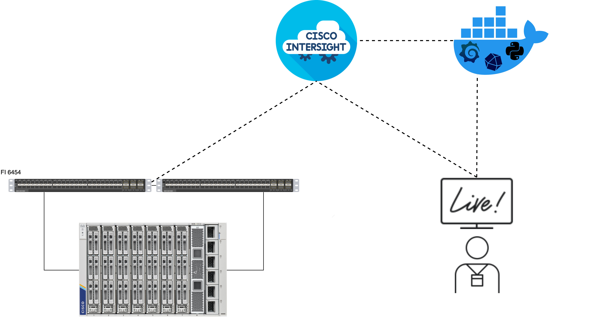


# Introduction & Context
Intersight is a tool to monitor and configure data center solutions such as UCS servers.
Intersight collects metrics from servers and makes them available for viewing in the GUI or for use through the API.

### Use cases for metric collection
<table><tr><td>Energy consumption in data centers is often a significant cost that is overlooked. This consumption may also be a factor for environmental impact. The administrator needs to determine the <strong>energy consumption</strong> of their environment</td>
<td>IT administrator has noticed issues with a workload. The administrator must <strong>identify</strong> if this is a UCS <strong>networking problem</strong>. The administrator needs to verify the single/multiple links between the server and Fabric Interconnect, as well as between the Fabric Interconnect and upstream network</td>
<td>With growing workloads there is also a demand for new infrastructure. To adapt to this demand, you may have to increase your UCS environment with a few more chassis. This will lead to increase traffic on the Fabric Interconnect uplinks. The administrator needs to <strong>determine</strong> if the current <strong>uplink capacity</strong> will be enough to handle the new infrastructure</td>
</tr></table>


During this workshop you'll use Intersight and automation to get metrics from UCS servers:
- [Explore Intersight GUI](#explore-intersight-gui)
- [Use Intersight REST Client](#use-intersight-rest-client)
- [Export data to Grafana](#export-data-to-grafana)

*Please use the image hint below each step if you're stuck.*

---

# Explore Intersight GUI

1. Go to [Intersight](https://intersight.com), click on Sign-in with Cisco ID

    <details><summary>Image</summary>
    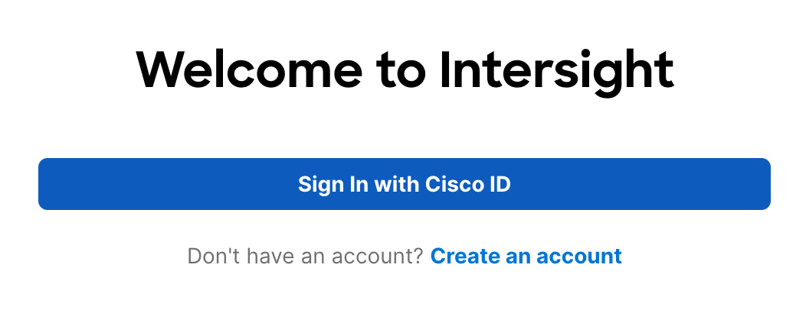
    </details>

2. When asked, provide the following credentials:
    <details>
    <summary>Reveal Mail</summary>

    ```
    DEVWKS2486+[YourTableNumber]@gmail.com
    ```
    </details>

    <details>
    <summary>Reveal Password</summary>
   
    ```
   
    ```
    </details>

    <details><summary>Image</summary>
    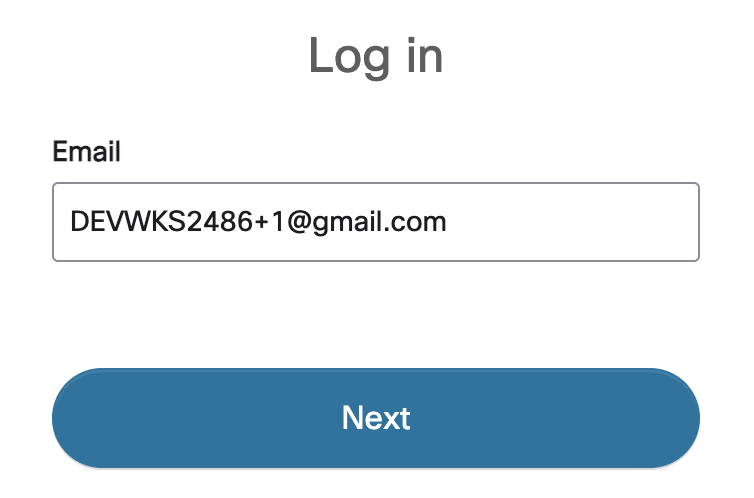
    </details>

   You'll be redirected to the main Intersight interface.

3. In the left panel, click on 'Operate', then select 'Servers'.
    <details><summary>Image</summary>
    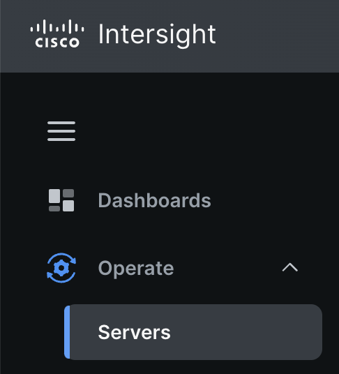
    </details>

4. Click on the server ***CSS-DCC1-1-1***, look for the **Metrics** tab and select it.
    <details><summary>Image</summary>
    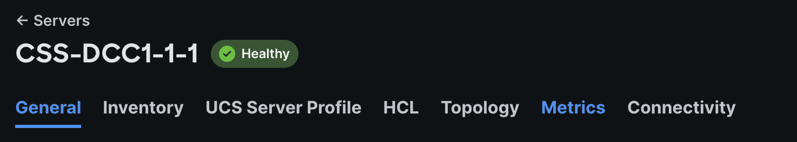
    </details>

5. Take a look at the metrics fetched by Intersight.
    <details><summary>Image</summary>
    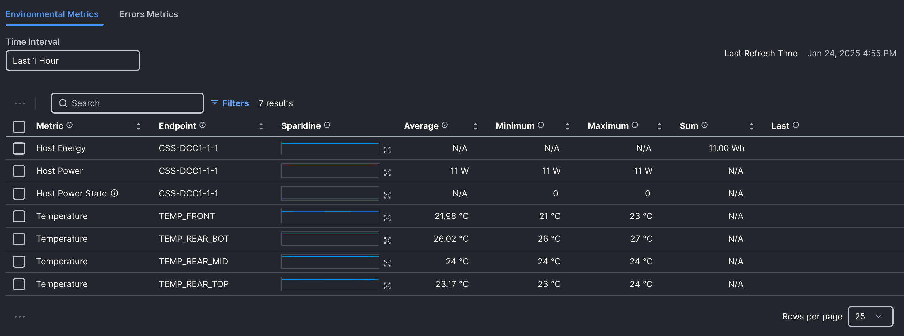
    </details>

    <details><summary>More details on the Data Collection Process (Optional)</summary>
    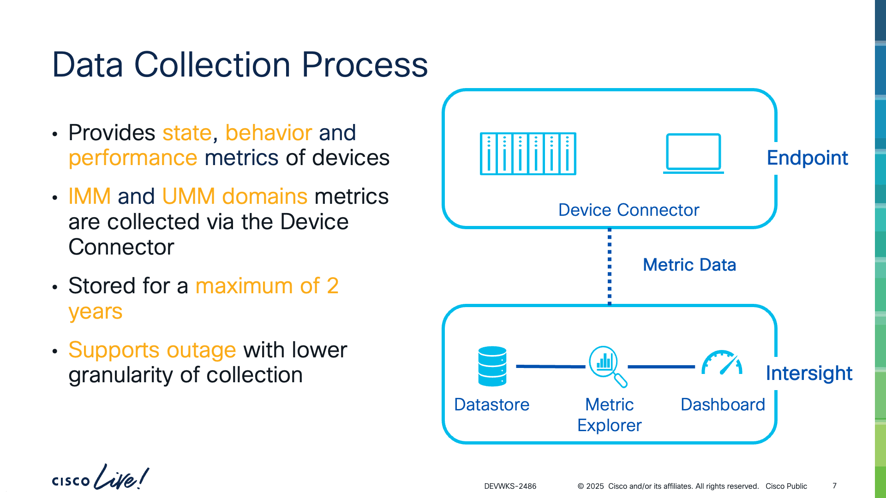
    </details>

6. Look for the panel on the left side of the screen and click on Analyse, then Explorer.
    <details><summary>Image</summary>
    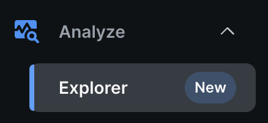
    </details>

    On the **Metrics Explorer** you'll be able to explore all the metrics gathered by Intersight from all devices and filter out of your preferences.

7. In the *Metrics panel*, select the metric to fetch:  ***Host Power and Status > Host Power > Average***.
    <details><summary>Image</summary>
    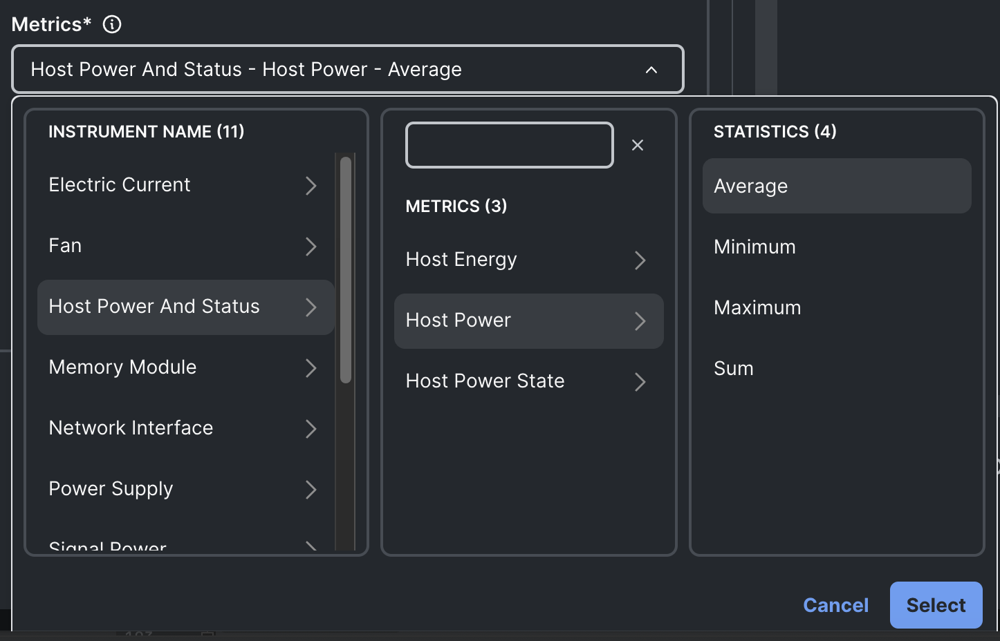
    </details>

8. A chart will appear according to the option selected on the *Metric Panel*. 
    <details><summary>Image</summary>
    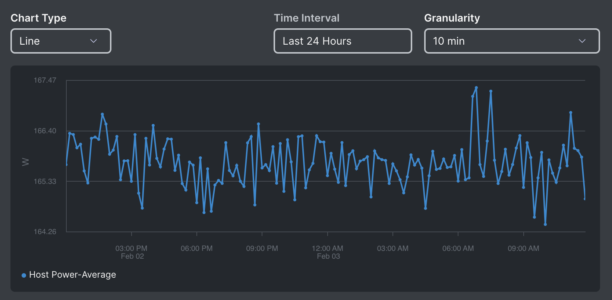
    </details>

9. Scroll down to see the **Raw Data** fetched from the Time-Series in the Intersight OpenTelemetry API.
    <details><summary>Image</summary>
    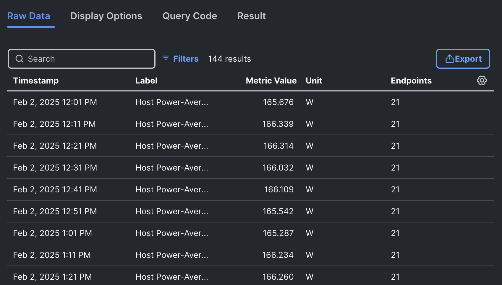
    </details>

10. Look for the **Query Code** tab. This is the JSON code send to the API to get the metrics.
    <details><summary>Image</summary>
    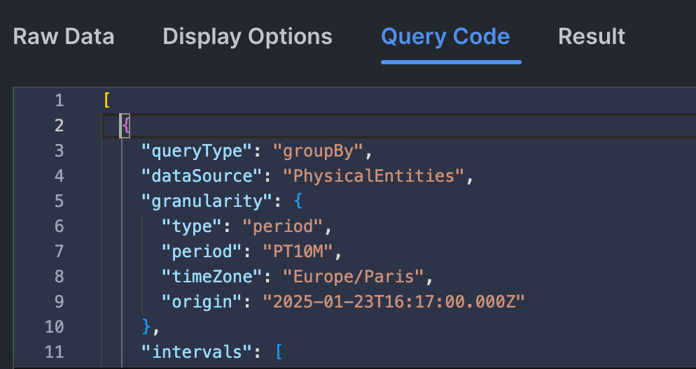
    </details>

11. Copy the code from the curly bracket in line 2 until the penultimate line with a closing curly bracket.
      <details>
        <summary>Click here to get JSON code instead</summary>
      
      ```
      {
          "queryType": "groupBy",
          "dataSource": "PhysicalEntities",
          "granularity": {
            "type": "period",
            "period": "PT10M",
            "timeZone": "Europe/Paris",
            "origin": "2025-02-02T11:01:00.000Z"
          },
          "intervals": [
            "2025-02-02T11:01:00.000Z/2025-02-03T11:01:00.000Z"
          ],
          "dimensions": [],
          "filter": {
            "type": "and",
            "fields": [
              {
                "type": "selector",
                "dimension": "instrument.name",
                "value": "hw.host"
              }
            ]
          },
          "aggregations": [
            {
              "type": "longSum",
              "name": "count",
              "fieldName": "hw.host.power_count"
            },
            {
              "type": "doubleSum",
              "name": "hw.host.power-Sum",
              "fieldName": "hw.host.power"
            },
            {
              "type": "thetaSketch",
              "name": "endpoint_count",
              "fieldName": "host.id"
            }
          ],
          "postAggregations": [
            {
              "type": "expression",
              "name": "hw-host-power-Avg",
              "expression": "(\"hw.host.power-Sum\" / \"count\")"
            }
          ]
        }
      ```
      </details>

---

# Use Intersight REST Client

1. Now visit the [REST Client](https://intersight.com/apidocs/apirefs/All/api/v1/telemetry/TimeSeries/post/) natively integrated into Intersight with this URL.
This portal allows you to view the Intersight API documentation and interact with it directly.
2. With this client, you can interact with the Time Series by sending a POST request from the right panel.
    <details><summary>Image</summary>
    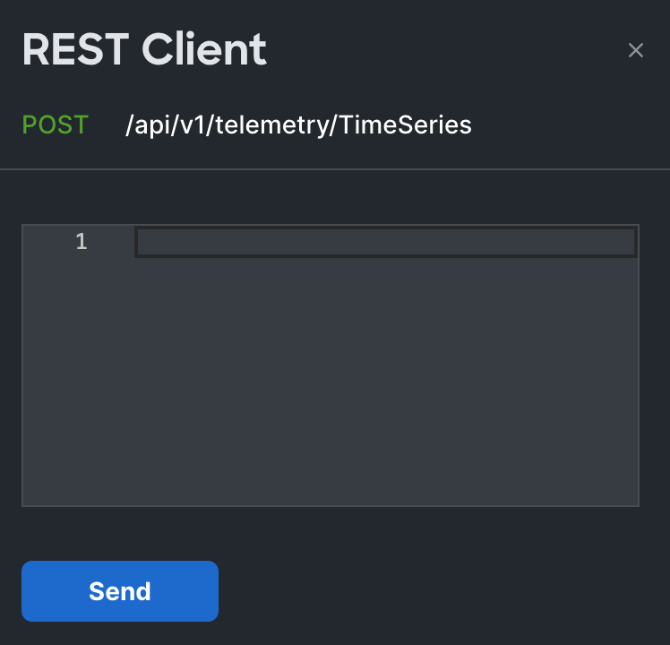
    </details>

3. Paste the copied JSON from earlier on the *POST panel* and click on Send. <sub>You may be asked to log in again</sub>
    <details><summary>Image</summary>
    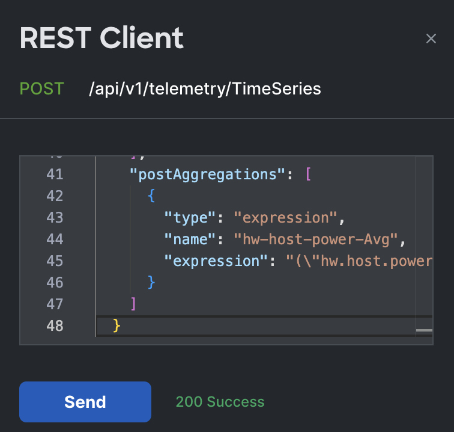
    </details>

4. You can recognise the same information as the **Raw Data** from the GUI within the *hw-host-power-Avg* variable.
    <details><summary>Image</summary>
    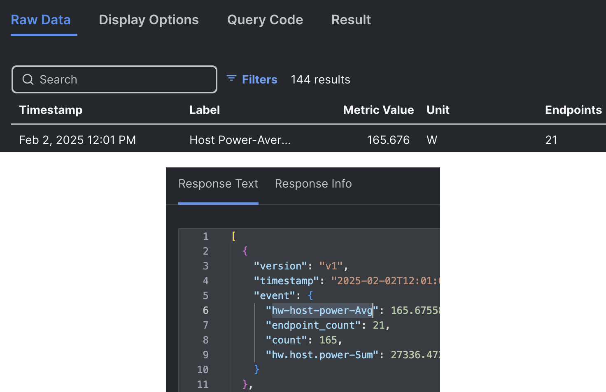
    </details>

___

# Export data to Grafana

Now, let's take it a step further and extract the data to use it in an observability tool such as Grafana.
To do this we will use a tool installed in your computer [Intersight-Metrics-Bridge](https://github.com/mabuelgh/intersight-metrics-bridge).
It will poll power metrics from Intersight, store them in InfluxDB, and display them in Grafana easily with containers. 
Your computer already has the necessary tools to make it work. Now **launch a terminal** in your computer. 

1. Go to the right directory:
```
cd ./Desktop/DEVWKS-2486/intersight-metrics-bridge
```
2. The API Key is not embedded in your session, we need to extract the API Key and inventory file from internet.
It's available from this remote repo, clone it with:
```
git clone https://github.com/mabuelgh/DEVWKS-2486-alt.git
```
3. Replace the placeholder API Key and inventory file with the one copied in last step.
The API Key is read-only access to the Intersight account from earlier. 
The inventory file contains a list of Serial Numbers to monitor. Use this command to use the files:
```
rm -f -r config && cp -f -r ./DEVWKS-2486-alt/config ./
```
4. To make the Metrics-Brigde work, we need to set environment variables with the following python script <sub>(this project is using a Python virtual environment.)</sub>
```
../bin/python initial_setup.py
```
5. Now that everything is ready, build the docker containers with the docker-compose command: 
```
sudo docker-compose build --no-cache
```
6. Wait a few minutes to have access to the terminal again and then start the containers.
```
sudo docker-compose up
```

7. **Don't close this terminal** and open a new terminal tab to make sure you have 3 containers up and running with this command:
```
sudo docker ps
```
8. Look for ***STATUS: Up*** for the three containers.
    <details><summary>Image</summary>
    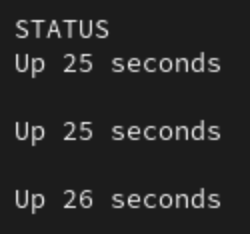
    </details>

9. Access the Grafana container created at [127.0.0.1:3000](http://127.0.0.1:3000).
10. The credentials are ***admin*** / ***password***
11. On the left panel, click on Dashboards and then select *Cisco UCS Servers Power Usage Dashboard*
    <details><summary>Image</summary>
    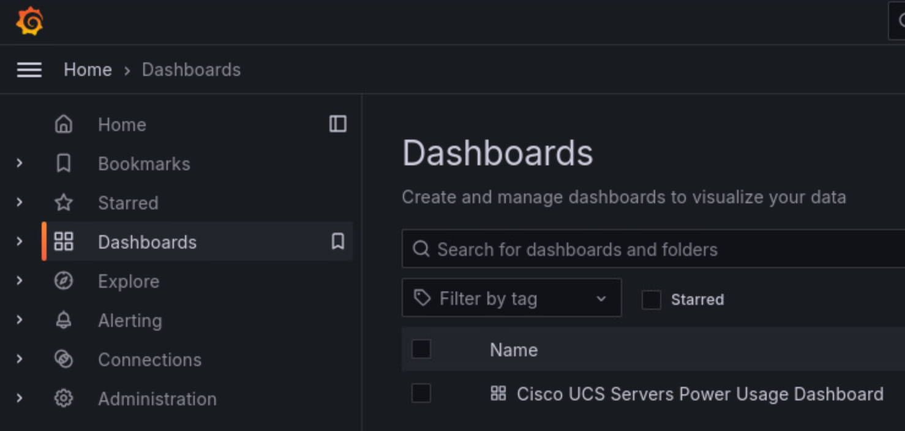
    </details>

12. Watch the metrics get collected every minute.
    <details><summary>Image</summary>
    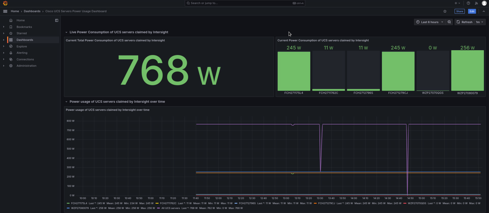
    </details>

13. When everything done, please stop (<kbd>Ctrl+C</kbd> on the main terminal tab, multiple times) and delete the containers for the next workshops 😊
```
sudo docker rm -f intersight-metrics-bridge-influxdb intersight-metrics-bridge-grafana intersight-metrics-bridge-intersight-poller
```

## Related information
- This GitHub page will be up for one week. 
- The webex space for this session will be up for at least 2 weeks. 
- The project [Intersight-Metrics-Bridge](https://github.com/mabuelgh/intersight-metrics-bridge) is already available to use on GitHub.
- You can contact me on:
    - https://www.linkedin.com/in/marc-aeg/
    - https://github.com/mabuelgh
    - [mabuelgh@cisco.com](mailto:mabuelgh@cisco.com)

<details><summary>Continue your Education</summary>
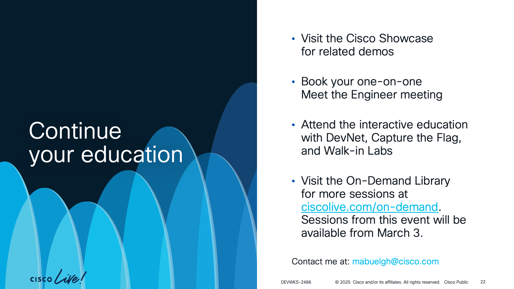
</details>

<details><summary>Webex App</summary>
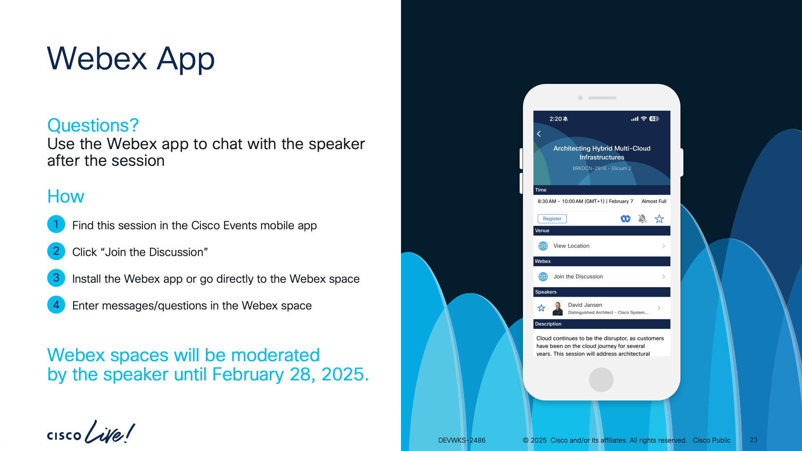
</details>

<details><summary>Survey</summary>
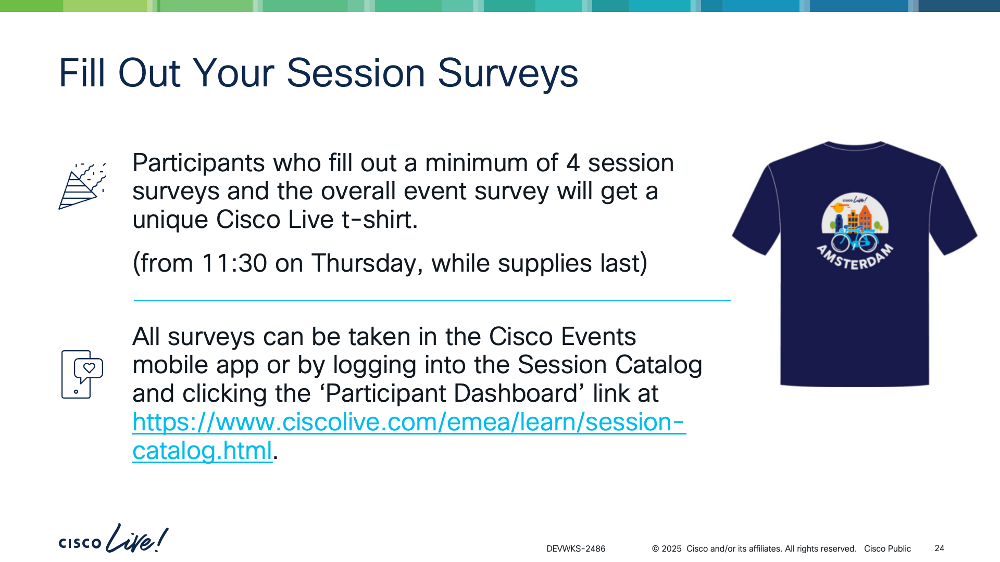
</details>

